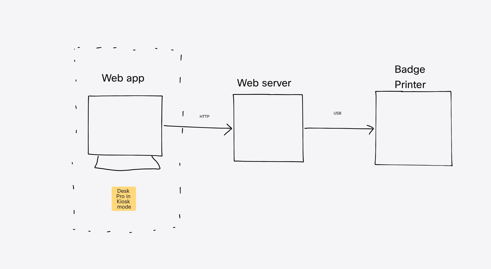

# Visitor registration system with Cisco Desk device

* Create your visitor web app, or fork this one:
  https://cisco-ce.github.io/roomos-samples/visitor-kiosk/ (demo)
  https://github.com/cisco-ce/roomos-samples/tree/main/visitor-kiosk (source code)

* Create a web server. It should
  * Serve your web app
  * Implement API routes for
    * Registering users
    * Printing the label 
    * Persist visitor list
    * Optionally: Search for hosts that the visitor will meet
    * Optionally: Sending message to host using Webex

* Update the web app to talk to your web server for the various use cases above
* Implement server functionality to send the generated sticker PDF to the printer

You can find an example of such a web server made in Python, on:

https://github.com/cisco-ce/visitor-sticker-server

## Recommended technology

- Device: Any Desk series (Desk Pro, Desk or Desk Mini) or Board series
- Server: Node.js or Python server
- Printer: a label printer that is easy to talk to from server
